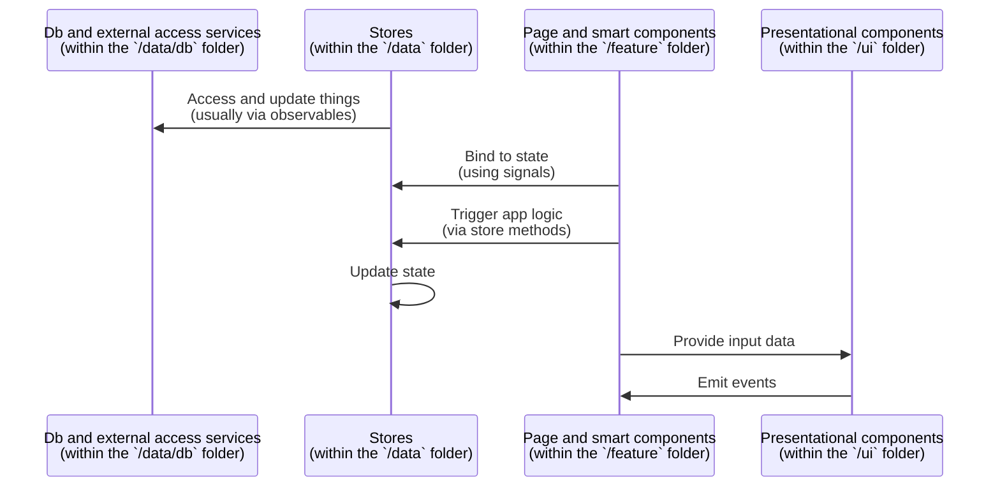

| ← Previous |                 ↑                 |                                      Next → |
| :--------- | :-------------------------------: | ------------------------------------------: |
| -          | [Go to index](../README.md#index) | [Routes and shell](./2.routes-and-shell.md) |

# Architecture

This simple example app is built on [the base template](https://github.com/FullStacksDev/angular-and-firebase-template/blob/main/README.md). Make sure to go through the base template's [README](https://github.com/FullStacksDev/angular-and-firebase-template/blob/main/README.md) and [ARCHITECTURE](https://github.com/FullStacksDev/angular-and-firebase-template/blob/main/ARCHITECTURE.md) docs beforehand, to get an understanding of the tech stack components, high level architecture and design decisions, then come back here to learn the specifics of this app.

## Frontend

This simple example app is frontend-heavy in that the majority of the functionality is built client-side, in the Angular app, which consists of:

- A new [`app/src/app/logbook`](../app/src/app/logbook) folder containing the logbook feature (detailed below).
- A new [`app/src/app/shared/models.ts`](../app/src/app/shared/models.ts) file where types are defined for the data model (and other related types), just for use on the frontend.
- Updated routes in the [`app/src/app/app.routes.ts`](../app/src/app/app.routes.ts) file to lazily load the logbook feature routes.
- A link to "Open logbook" in the navigation of the website's static pages (i.e. in [`app/src/app/website/website-shell.component.ts`](../app/src/app/website/website-shell.component.ts)).

| **:white_check_mark: Pattern** |
| :-- |
| We don't use [Angular modules (i.e. `@Module`)](https://angular.dev/guide/ngmodules) for our own code — we've chosen to go all-in on [Angular's recent **standalone** approach](https://angular.dev/guide/components/importing#standalone-components). So we only ever define (and prefer to import) standalone components, directives, etc.<br><br> The base template has configured the Angular CLI generator to always set the `standalone: true` flag on any components, directives, etc. you generate. |

| **:brain: Design decision** |
| :-- |
| Since this app is frontend-heavy we've decided to put all the data model types (and other useful types) in a file within the `app` folder, as opposed to putting these in [`firebase/common/models.ts`](../firebase/common/models.ts) (as provided by the base template) where they would be available to both the frontend and backend. |

> [!NOTE]
>
> In the patterns example app (coming soon) we show you how to better share data model types between the frontend and backend.

### The logbook feature

```text
app/src/app/logbook
└─ data
   └─ db
      └─ {db services}
   └─ {stores}
└─ feature
   └─ {pages and smart components}
└─ ui
   └─ {presentational components}
└─ logbook-shell.component.spec.ts
└─ logbook-shell.component.ts
└─ logbook.routes.ts
```

- The routes and shell files are in the root of the logbook feature folder.
- All other files are split between `data`, `feature` and `ui` subfolders.
  - The `data` folder contains the services and stores that handle the data layer.
    - All services that wrap Firebase access are in the `data/db` subfolder.
  - The `feature` folder contains the pages and smart components that make up the feature itself.
  - The `ui` folder contains presentational components that are used by the feature.

We'll dig into these in more detail in later documents.

> [!NOTE]
>
> Think of **smart components** as more involved components that have access and awareness of the broader application state and logic, via stores and other services. They don't function just as black boxes and are not usually reusable across different parts of the app.
>
> Think of **presentational components** as simple and naive components that only know their inputs and outputs, making no assumptions of the overall application state and structure. They should be easy to test (as a black box) and easy to reuse.

| **:white_check_mark: Pattern** |
| :-- |
| As mentioned in the base template, we highly recommend separating the code within the top-level feature folders into the following subfolders: **`data`**, **`feature`**, **`ui`** and **`util`**. And trying to keep both the top-level feature folders and these subfolders at one hierarchical level. We've found that this is a great starting folder structure (and general architecture) which helps you quickly find stuff, whilst spending minimal time on figuring out what goes where.<br><br>The `data` folder is for (most) state management and data access services. Page and smart components go in the `feature` folder, whilst presentational components go in the `ui`folder. And the `util` folder is for standalone utilities.<br><br>This is a recommended folder structure based on [Nx's suggested library types](https://nx.dev/concepts/more-concepts/library-types).<br><br>For features within the `shared` folder you should follow the same structure, except you probably won't need a `feature` subfolder within each shared feature since these are shared bits of code for use elsewhere.<br><br>As things grow you may need to adapt and tweak this structure (e.g. to add another level in the hierarchy) — we'll see how to tackle this in the patterns example app (coming soon). |

> [!IMPORTANT]
>
> As a reminder, all the Angular components (including ones generated through the Angular CLI) have been configured to use the [`OnPush` change detection strategy](https://angular.dev/best-practices/skipping-subtrees#using-onpush) by default.
>
> This is a more performant approach that [works well with Angular's signals](https://angular.dev/guide/signals#reading-signals-in-onpush-components), and since we use NgRx SignalStore and Angular's signals to manage most application state you are unlikely to hit the cases where change detection is not triggered when it should be.
>
> With the caveat that forms _sometimes_ don't behave well with OnPush change detection, so in rare cases you'd need to use the `ChangeDetectorRef` to manually mark a component for change detection.
>
> As long as you stick to the approaches promoted in the example apps you should not encounter any change detection issues (i.e. where underlying data changes but the UI does not update).

### Data flows, app logic and UI components architecture

Within the frontend app, it's important to have an architecture in place for reasoning about data flows, app logic and UI components with some "rules" to make things predictable and easy to scale up with more features, and manage growing complexity. Thus, knowing where things go and how data flows between backend, services, and components is crucial.

We highly recommend the following generalized data and logic flows — we follow this extensively in the example apps:



(Ignore the time-ordering of this sequence diagram, it's just a way to visualize the data flow — it's not a strict sequence of events.)

- Use Angular services to wrap ALL access to databases and external services.
- Use state management "stores" to encapsulate as much of the app's state and behavior as possible, leaving components to focus on UI needs, triggering store behaviors and responding to state changes.
- Use smart components to interact with stores to bind state and trigger application logic.
- Use presentational components (within the template of smart components) to abstract out UI presentation and logic in a way that does not need to know about the overall application state and structure, communicating all actions/events back to the parent smart component.

We'll cover these in more detail, in the context of the simple logbook feature, in later documents.

### Stores

> [!IMPORTANT]
>
> As you can see from the previous diagram, stores are the main mechanism for state management and can be considered the central _hubs_ or _engines_ for your application's state and logic. They are the single source of truth for the app's state and are the only place where this state is updated, as well as being the only place where related app logic is triggered. This makes it easy to reason about the app's state and behavior, and to test and debug it, by decoupling it from the UI.

> [!TIP]
>
> Another approach to thinking about stores and state management is, rather than thinking:
>
> _"How do these actions and events change the user interface?"_
>
> … think:
>
> _"How do these actions and events change the state of the application? How can I use this state to drive UI and flows, or what additional state do I need to model?"_

There are different levels of stores, scoped to particular contexts:

- **Global stores** — a single instance available to be injected in any component or service.
  - Marked with `providedIn: 'root'` in the `@Injectable` decorator so Angular knows to make them available globally and only maintain one instance.
  - The [`app/src/app/shared/auth/data/auth.store.ts`](../app/src/app/shared/auth/data/auth.store.ts) (provided by the base template) is an example of a global store.
- **Feature stores** — provided at the route level (for lazily loaded feature routes) and available to all components within the feature.
  - The stores in the logbook feature are feature stores — they are provided at the route level (covered in a later document).
- **Component stores** — provided and injected in a component and available to it and its children only.
  - Can be provided in multiple components, where Angular will create and maintain _separate_ instances. A useful way to have a store that is scoped to a particular part of the UI, but also reused in multiple places (e.g. a component store for a list item).
  - The [`app/src/app/login/feature/login-flow.store.ts`](../app/src/app/login/feature/login-flow.store.ts) is an example of a component-level store.

> [!TIP]
>
> When we say an Angular "service" (or "store" — which is just an Angular service under the hood) is "provided" somewhere we mean that it's registered with Angular's dependency injection system so that it can be injected into the services and components within the scope of that provider context (i.e. either globally, or within a smaller context like a particular set of lazily loaded routes or a particular component tree).
>
> You can read more about Angular's dependency injection system in [the official guide](https://angular.dev/guide/di).

> [!NOTE]
>
> Components (both smart and presentational) can sometimes manage their own internal state directly if having a separate component-level store is overkill. For example, a simple form component that manages all form state directly within the component and doesn't _really_ benefit from a separate store attached to the component.
>
> Though note that once the component starts to grow in complexity, it's often a good idea to move the state management to a separate component-level store, to keep the component focused on UI concerns.

## Backend

We rely on [Firebase's security rules](https://firebase.google.com/docs/rules) to control access to Firestore and Realtime Database from the frontend.

We use [Firestore indexes](https://firebase.google.com/docs/firestore/query-data/indexing) to support the queries we make from the frontend and disable ones we don't need (to avoid unnecessary costs).

We don't make use of Firebase Functions in this simple example app, partly so it can run within Firebase's "no-cost" tier, and also to showcase how to build a simple (but capable) web app without them.

> [!IMPORTANT]
>
> If you're used to a more traditional client-server access model where the server controls all access to a database via an API then Firebase's approach of making direct database calls from the client-side may seem counter-intuitive (and even scary) at first. If it helps, consider that there is still _some form of an API_ that these database calls go through — the security rules, which essentially encode the business logic on what can and cannot be accessed, in its own domain specific language (albeit limited to access and basic validation).
>
> You can still achieve a more traditional server-side API style with Firebase Functions and the Firebase Admin SDK, but we don't use that in this simple example app.

> [!NOTE]
>
> We use Firebase functions extensively in the patterns example app (coming soon), for capabilities that need proper backend support and can't be achieved with just client side code and Firebase's security rules.

> [!WARNING]
>
> It's best to have as much encoded in the codebase as possible, especially the security rules and indexes, in their relevant files, which will be pushed to Firebase as part of the deployment run.
>
> So don't make changes to these directly in the Firebase console, as they _might_ be lost on the next deploy, or you may lose track of what is live and end up with multiple sources of truth.

---

| ← Previous |                 ↑                 |                                      Next → |
| :--------- | :-------------------------------: | ------------------------------------------: |
| -          | [Go to index](../README.md#index) | [Routes and shell](./2.routes-and-shell.md) |
