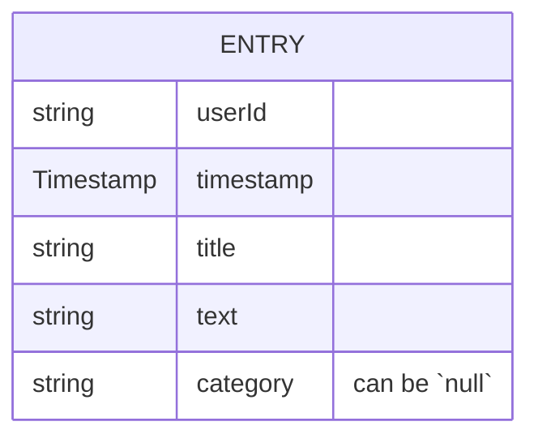
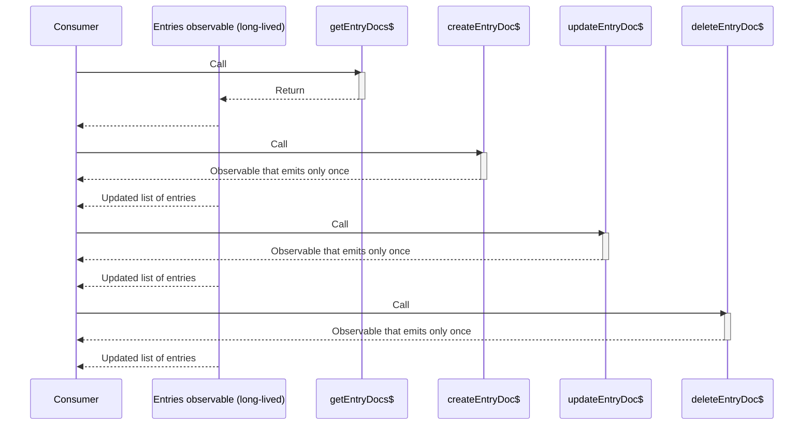

| ← Previous | ↑ | Next → |
| :-- | :-: | --: |
| [Routes and shell](./2.routes-and-shell.md) | [Go to index](../README.md#index) | [Logbook stores](./4.logbook-stores.md) |

# Data model and access

The backbone of most apps is the data model, and how it's accessed and updated.

Revisiting the [spec of the simple example app](TODO) we see that only one logbook is required per logged-in user, and a logbook consists of a flat list of time-ordered _entries_. This is a fairly simple and common data model for many apps and can be modeled as a single "table" (or "collection", in Firestore) of data items differentiated per user.

This list of entries is stored in Firestore in a single collection called `entries`. Each entry is associated with a user via a `userId` field, which matches their Firebase Auth user ID. We then use security rules to control access — i.e. to ensure that a user can only retrieve and modify their own entries. We access all data from the frontend (so no server-side access in this case), using the Firebase JavaScript SDK, where we convert data from Firestore into strongly typed objects using TypeScript, within an Angular service that wraps all access to Firestore.

We'll cover how this is then used to enable the logbook feature, later in a separate document.

| **:white_check_mark: Pattern** |
| :-- |
| Whilst Firestore is not a relational database (like PostgreSQL or MySQL), it's still a good idea to _start_ from the principles of relational database modelling. In particular: breaking down your domain model into separate database tables connected by foreign keys (known as "normalization"). Once you have this, you can then consider how to denormalize the data to better fit Firestore's document-based model and to optimize for the queries you need to make.<br><br>In the case of this simple example app, we don't need to denormalize the data as the data model is already flat and simple enough. |

## Firestore data model

> [!TIP]
>
> Firestore calls its data items "documents" and they are stored in "collections". This is similar to the "rows" in a "table" of a relational database, but with some key differences. It's worth reading up on the [Firestore data model](https://firebase.google.com/docs/firestore/data-model) to understand these differences.

> [!IMPORTANT]
>
> Technically, Firestore is a _schemaless_ database, which essentially means that you can store anything you want in any document, with differing data types and minimal database-level validation. The only constraints come from the security rules and your application-level code (frontend and backend).
>
> This makes it very flexible, and can make for higher scalability, but also means that you need to be careful to ensure that your data is consistent and that your application code is robust. Not all data fields in an app require a highly stringent schema or set of constraints, so it's always a trade-off and depends on the specific use case.

> [!CAUTION]
>
> It's important to understand how Firestore, in particular, is billed to ensure you keep control of your costs (if that matters to you). Firestore charges for individual reads, writes, deletes, storage, transfer, etc. and the costs can add up quickly if you're not careful.
>
> For a good initial understanding see the [Firestore pricing page](https://firebase.google.com/docs/firestore/pricing).

| **:brain: Design decision** |
| :-- |
| We've chosen to store all entries — for all users — in one Firestore collection, controlling access using security rules.<br><br>Another approach could've been to store a user's entries in a _subcollection_ of a "user" or "profile" parent document (where each user has one of these parent documents, and everything in the subcollections of that parent belong to that user). |

The core of the data model for the simple example app is:



- `userId` is the Firebase Auth "User UID" for the logged in user.
- `timestamp` is a Firestore `Timestamp` type, which we set to be "server-generated" when creating entries.
- `title` and `text` are both string fields and make up the actual content of the logbook entry.
- We'll look at the `category` field in a dedicated section, below.

| **:white_check_mark: Pattern** |
| :-- |
| Never store the ID of the document in the document itself, as this will duplicate the ID that Firestore auto-generates (or you explicitly set) and has the risk of getting out of sync. Instead, use the Firestore document ID to reference the document and merge it into the data object on client-side when fetching data (see below). |

## Firestore security rules

Given the design decision to store all entries in a single collection, we first set up the security rules to ensure proper access control:

<https://github.com/FullStacksDev/angular-and-firebase-simple-example-app/blob/62002e62aaff2f64552e4e98aba326c7fe6ab235/firebase/firestore.rules#L4-L19>

- This is a special "domain specific language" (DSL) that Firestore uses to define access control rules in the [`firebase/firestore.rules`](../firebase/firestore.rules) file ([docs](https://firebase.google.com/docs/firestore/security/get-started)).
- `isAuthed()` and `matchesAuthedUser(userId)` are helper functions we've defined to allow easy reuse in multiple rules.
- We use the special `request.auth.uid` field to check the ID of the user making that Firestore operation.
- The `match /entries/{document=**}` line is a "wildcard" rule that applies to all documents in, and subcollections of, the `entries` collection.
- For the `read` and `delete` operations we ask Firestore to check the `userId` field of the requested document (the `resource.data.userId` field).
  - This ensures that a user can only read or delete their own entries.
- For the `create` operation we ask Firestore to check the `userId` field of the data being written (the `request.resource.data.userId` field).
  - This ensures that a user can only create entries with their own `userId`.
- For the `update` operation we ask Firestore to check _both_ the `userId` field of the data being written (the `request.resource.data.userId` field) _and_ the `userId` field of the existing document (the `resource.data.userId` field).
  - This ensures that a user can only update entries with their own `userId` and that they can't change the `userId` field of an existing entry.

We add some fairly extensive tests in [`firebase/test/firestore/firestore-rules.spec.ts`](../firebase/test/firestore/firestore-rules.spec.ts) to ensure that these work as expected. These tests run against an instance of the local emulator, which is started and stopped as part of the `pnpm test` command.

## Firestore indexes

> [!IMPORTANT]
>
> By default, [Firestore will create indexes for all fields in a collection](https://firebase.google.com/docs/firestore/query-data/index-overview#automatic_indexing). It's important to be aware of this as it can lead to unnecessary costs, since each index counts towards Firestore storage costs.

In [`firebase/firestore.indexes.json`](../firebase/firestore.indexes.json) we:

1. Add a compound index on the `userId` and `timestamp` fields, as we're always filtering entries by `userId` and ordering by `timestamp`.
1. Add a compound index on the `userId`, `category`, and `timestamp` fields, as we're filtering entries by `userId` and `category`, and ordering by `timestamp`.
1. Disable the automatic single-field indexes on the `title` and `text` fields, as we don't need to filter or order by these.

> [!NOTE]
>
> Sometimes, you may already know you need a compound index, but this may take time to learn and build an intuition for. No worries, as Firebase will error and tell you when you need to add a compound index, with a link to the Firebase Console where you can create the index. But note that we highly recommend you don't use the Console to do this and instead add the index to the `firestore.indexes.json` file and then deploy it using `pnpm firebase deploy -P live --only firestore:indexes`.
>
> Indexes may take some time to build — you can see the status of these in the Firebase Console.

## Firestore client-side access

### TypeScript types

Both Angular and the Firebase JavaScript SDK have first class support for TypeScript — Angular was one of the first frameworks to get on the TypeScript bandwagon, ever since it's first stable release in 2016.

When loading entries from Firestore we want to assume they take a particular _shape_ — the `EntryDoc` type — which the TypeScript (and VS Code) tooling can then use to look for type errors and provide code completion.

<https://github.com/FullStacksDev/angular-and-firebase-simple-example-app/blob/62002e62aaff2f64552e4e98aba326c7fe6ab235/app/src/app/shared/models.ts#L15-L23>

- This uses the `Readonly` TypeScript utility type to mark the whole object as readonly.
- We build on the `WithId` type from the [`firebase/common/models.ts`](../firebase/common/models.ts) file, which adds the `id` field to the object.
  - We're using TypeScript's intersection operator (`&`) to combine the `WithId` type with the rest of the fields, to make up the `EntryDoc` type.
  - We'll see below how this `id` field is populated.
- The rest of the fields conform directly to the data model defined earlier.

| **:white_check_mark: Pattern** |
| :-- |
| Use the `Doc` postfix for the ending of all type names that correspond to a document loaded from a collection from Firestore. This is purely a naming convention and makes it easier to see when we're referring to an actual Firestore document versus regular data / objects. |

| **:white_check_mark: Pattern** |
| :-- |
| Mark types as `Readonly` when you know for sure they should never be mutated once loaded. This works well for data that comes from a database and is only ever read from and displayed. It's a good way to ensure that you don't accidentally mutate the data and cause state bugs. |

In the same file we also define a special `NewOrUpdatedEntryInput` type for the data we send to Firestore when creating or updating an entry:

<https://github.com/FullStacksDev/angular-and-firebase-simple-example-app/blob/62002e62aaff2f64552e4e98aba326c7fe6ab235/app/src/app/shared/models.ts#L25>

Here we're picking a subset of the fields from the `EntryDoc` type — we only want to allow the user to set or update these fields.

| **:brain: Design decision** |
| :-- |
| It's possible to lock down the setting or updating of particular fields using security rules (essentially, server-side validation). For example, we could define a rule to prevent the `timestamp` field from being updated by the user (as we only want it to be set at creation, on the server). We do restrict this via the frontend code and user interface, but right now the user could technically make a direct Firestore call (e.g. in the web page console) to update the `timestamp` field.<br><br>The same applies to validating the presence of fields — this could be achieved using security rules, but for now we rely on client-side validation only.<br><br>We deem these to be acceptable risks for this particular app, but it's something you would need to take into account for your particular use cases. |

> [!IMPORTANT]
>
> One thing we can't risk is a user setting the `userId` field to something other than their own user ID (whether when creating a new entry or updating an existing one). This is why we have made sure to add security rules to enforce this, as well as a test suite to check this in the local emulator.

### Firestore access service

The [`EntriesService`](../app/src/app/logbook/data/db/entries.service.ts) is where we wrap all Firestore access to the `entries` collection.

| **:white_check_mark: Pattern** |
| :-- |
| Wrap all Firebase access into dedicated Angular services that can be injected (and also mocked in tests). For services that wrap Firestore or Realtime Database place them in the `data/db` subfolder of the feature (or shared) folder. |

| **:white_check_mark: Pattern** |
| :-- |
| Always mark these data access services as global (i.e. `@Injectable({ providedIn: 'root' })`) as the Angular compiler is smart enough to know to optimise the bundling and only put the code into the chunk that needs it (and thus lazy load it). This works well for these data services as they are almost always consumed by higher level services (like stores). |

Let's walk through this service:

First, we inject the Firestore client using the helper provided from the base template:

<https://github.com/FullStacksDev/angular-and-firebase-simple-example-app/blob/62002e62aaff2f64552e4e98aba326c7fe6ab235/app/src/app/logbook/data/db/entries.service.ts#L29>

Next, we define a special converter object that the Firestore JavaScript library understands. We also define a reference to the collection (which we use in the actual data access methods):

<https://github.com/FullStacksDev/angular-and-firebase-simple-example-app/blob/62002e62aaff2f64552e4e98aba326c7fe6ab235/app/src/app/logbook/data/db/entries.service.ts#L31-L51>

[Firestore converters](https://firebase.google.com/docs/firestore/query-data/get-data#custom_objects) are a first class way to convert Firestore document data into strongly typed objects, and back. A converter is an object that conforms to the `FirestoreDataConverter` type, which requires two methods:

- A `fromFirestore` method that takes a Firestore document's data and converts it into an `EntryDoc` object, which will be used by Firestore data retrieval methods.
- A `toFirestore` method that takes a partial `EntryDoc` object (i.e. anything that confirms partially to its shape) and converts it into data that can be used to create or update a Firestore document.

> [!TIP]
>
> It's possible to perform data validation in these converter methods to further check and constrain what goes in and out of the database (though only client-side, here).

The collection reference we define then uses this converter. So anything that builds off this reference will automatically have the converter applied.

Finally, we have the actual data access and update methods in the service (which wrap the Firestore JavaScript library methods):

- `getEntryDocs$` returns a long-lived observable of the entries for the specified user, ordered by `timestamp`.
  - Any realtime updates are emitted as new values in the observable. So any updates made to the underlying data (e.g. via the other methods in this service) will trigger a new emission of the entries list in the observable.
  - Pagination and filtering parameters are passed in to scope the query appropriately. The private method `#buildQuery` takes these parameters and constructs an appropriate Firestore query object.
    - The most important query parameter is the `userId`, which MUST be applied to all queries (the security rules won't even allow a fetch without it).
    - We'll discuss how pagination and filtering work in later documents.
- `createEntryDoc$` and `updateEntryDoc$` are used to create and update entries, respectively.
- `deleteEntryDoc$` is used to delete an entry.

| **:white_check_mark: Pattern** |
| :-- |
| As much as possible use an explicit return type for functions. For example, all the public functions mentioned above explicitly define their return type in the function declaration (in this case, all `Observable<SomeType>`). This is to declare _intent_ and allow the compiler to catch any potential issues for you (where you expect the function to return one type but it actually ends up returning another). |

> [!NOTE]
>
> Both Firestore and Realtime Database provide the ability to fetch data and then listen for any new changes. This allows us to build realtime applications, as we show you in this example app.
>
> For Firestore, it's important to be aware of [the costs of running these long-lived listeners](https://firebase.google.com/docs/firestore/pricing#listens) since Firestore charges for a read _per document_. This is where pagination is very important, as we'll cover in a later chapter.

Here is an example data flow between the methods to show how they interact together (time-ordered from top to bottom):



As you can see, _reads_ are distinctly separated from _updates_ (loosely based on the [command-query separation (CQS) principle](https://en.wikipedia.org/wiki/Command%E2%80%93query_separation#Command_Query_Responsibility_Separation)) and we rely on the realtime nature of Firestore to keep the original observable returned from the `getEntryDocs$` method up to date with any relevant changes.

| **:brain: Design decision** |
| :-- |
| Even with the advent of signals, RxJS-based stream processing is still an important tool in our toolbox as it is a powerful way to work with _changes over time_, and has very good interoperability with Angular's signals. We use it extensively in the example apps to manage these streams of data from Firestore and Realtime Database (and more). <br><br>To bridge the gap between the Firebase JavaScript SDK and RxJS we use [`rxfire`](https://github.com/FirebaseExtended/rxfire) — a third-party library that provides a set of functions that wrap the SDK and return observables. We, in turn, alias these functions in the relevant Firebase helper module (e.g. [`app/src/app/shared/firebase/firestore.ts`](../app/src/app/shared/firebase/firestore.ts)) so we can centralize these functions and do minor things like add a `$` at the end of the function name (to denote that the function returns an observable). |

| **:white_check_mark: Pattern** |
| :-- |
| All methods of these data access services should return an observable, so that it's easy to plug into the state management lifecycle and chain other operations. This is the case even if the method does an operation that only triggers once and finishes. This gives us a common and predictable interface.<br><br>Add a `$` to the end of any function name, class field or variable that returns or contains an observable. This makes it easy to quickly see when something is expected to be an observable (and is a common convention used in the Angular / RxJS world). |

| **:white_check_mark: Pattern** |
| :-- |
| Use the verbs `create`, `update` and `delete` to name any function and variable names that operate on Firestore and Realtime Database documents and objects. This makes it easy to quickly see when we're dealing with Firestore or Realtime Database operations.<br><br>You’re of course free (and encouraged) to use whatever terminology you want in the user interface (UI) to best describe to end users what actions are available / taking place — this naming suggestion is purely at a code consistency level. |

> [!CAUTION]
>
> It is vital to unsubscribe from any long-lived observables once they are no longer needed. This is a common problem that leads to memory leaks and unexpected behavior in Angular applications.
>
> In this tech stack we use techniques like proper use of RxJS flattening operators (e.g. `switchMap`), `takeUntilDestroyed` and NgRx SignalStore's `rxMethod` to ensure that observables are cleaned up (and underlying resources disconnected) once no longer needed.

## Modelling the `category` field

The `category` field (of the `EntryDoc`) is modelled as a string field that can contain a `null` value.

We want to allow the following cases:

1. An entry with no category (i.e. `null`).
1. An entry with a category, from a predefined list of categories.

As explicitly specified in the spec, this predefined list of categories can be updated by an admin without requiring code changes. I.e. they are stored somewhere editable only by an admin, and pulled into the app at runtime, where they are used to populate the category option in the entry form and also in the filter options. Also, we ensure these categories are updated in realtime when an admin updates the list.

| **:brain: Design decision** |
| :-- |
| We've chosen to store these predefined categories in Firebase's Realtime Database, under a special `config` object that can be read by anyone but never updated from the client-side, only from the Firebase Console directly (or server-side).<br><br>We make sure to use a very simple data structure, so that it’s hard to mess up, since the Firebase Console only provides a simplistic editing approach with no extra data and schema validations (that you might be used to in a proper content management system). |

> [!CAUTION]
>
> All edits you make in the Realtime Database editor in the Firebase Console are saved automatically and will be sent to any connected clients that are listening out for changes.

The `config` object in the Realtime Database is structured like this:

```json
{
  "config": {
    "categories": {
      "Friends": "",
      "Fun": "",
      "General": "",
      "Hobbies": "",
      "Other": "",
      "Personal": "",
      "Reading": "",
      "Work": ""
    }
  }
}
```

Note that these are just example categories, and you can put whatever you want within the `categories` object in your running instance. If you do run this simple example app locally then make sure you populate some categories in the local emulator instance of the Realtime Database.

> [!TIP]
>
> During local development, you can access an editor for the local emulator instance of the Realtime Database by going to <http://127.0.0.1:4000/database> in your browser when the emulator is running.

Because Realtime Database doesn't natively support arrays we have to model the categories as an object with keys and empty string values. We then flatten this object into an array of strings in the client-side code.

> [!WARNING]
>
> An important caveat whenever making configurable data like this available for users to choose from is that _you should never substantially edit or delete an existing value_, as existing logbook entries may already use that same category, and since we're using this list to populate the filter options (more on this in a separate document) it would be confusing for users if a category they've used in the past suddenly changed or disappeared.

> [!NOTE]
>
> We could’ve implemented a more elaborate data structure for these categories, with a unique ID, description, CSS class names (e.g. for color customization), etc. But then it would be more error prone to make edits via the Firebase Console (as you can’t have data validation there). You would need to build a dedicated admin panel, or use a proper content management system (CMS), to make those edits. And at that point it’s worth reconsidering how best to implement an app-wide config system, with proper versioning etc. (or even using Firebase's Remote Config, though that’s not currently supported in local emulators).

We then have some very basic security rules to allow anyone to read but no one to write (from the client-side):

<https://github.com/FullStacksDev/angular-and-firebase-simple-example-app/blob/62002e62aaff2f64552e4e98aba326c7fe6ab235/firebase/database.rules.json#L1-L8>

We add some tests in [`firebase/test/rtdb/rtdb-rules.spec.ts`](../firebase/test/rtdb/rtdb-rules.spec.ts) to ensure that these work as expected.

Finally, we have a service that wraps access to this config object (and thus the underlying categories): [`ConfigService`](../app/src/app/logbook/data/db/config.service.ts). The key line in this service is where we flatten the `categories` object into an array of strings:

<https://github.com/FullStacksDev/angular-and-firebase-simple-example-app/blob/62002e62aaff2f64552e4e98aba326c7fe6ab235/app/src/app/logbook/data/db/config.service.ts#L29-L32>

Next we look at how we build on top of these data access services to drive state management and app logic using stores.

---

| ← Previous | ↑ | Next → |
| :-- | :-: | --: |
| [Routes and shell](./2.routes-and-shell.md) | [Go to index](../README.md#index) | [Logbook stores](./4.logbook-stores.md) |
