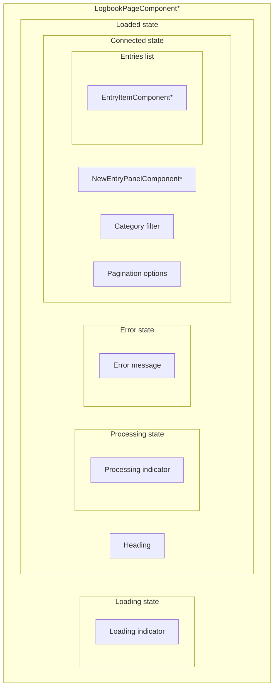

| ← Previous | ↑ | Next → |
| :-- | :-: | --: |
| [Logbook stores](./4.logbook-stores.md) | [Go to index](../README.md#index) | [Testing](./6.testing.md) |

# Logbook UI and flows

The main user interface (UI) of the logbook feature in this simple example app is the **logbook page** — this is where the user can view, filter, create, update and delete entries in their logbook.

> [!NOTE]
>
> In this document, we'll show less code snippets than previous documents, as it gets quite messy and verbose to show all the various component code and template bits inline.
>
> We strongly recommend opening up the code for each component in your editor (or on GitHub) and following along with the explanations here.

## Logbook page structure

| **:white_check_mark: Pattern** |
| :-- |
| Page components should always end with the word `Page` in the component name, and `-page` in the filename (e.g. `logbook-page.component.ts`). This is just a naming convention that helps differentiate them easily from other components, telling us that they are expected to be used in route definitions.<br><br>You can still generate these components using the Angular CLI, as usual — just make sure to add the word "page" in the name of the component you're generating.<br><br>Note also that page components are smart components, as they access app state and logic directly, via stores (and maybe other services). |

> [!TIP]
>
> When first building out a new feature, it's unlikely that you will know _exactly_ how it needs to be organized and structured from the start, especially as you'll want to try things out, put it in front of users and iterate. So it's best to start simple and then refactor as you go.

We took an iterative approach when building the logbook feature. We started with implementing everything in the [`LogbookPageComponent`](../app/src/app/logbook/feature/logbook-page.component.ts), with the new entry flow first and a simple list of entries, and then layered in the other capabilities, breaking UI bits out into separate components (where necessary) to make things more manageable and easier to reason about.

We ended up with the following structure:



- Components marked with `*` are the ones we've built out (as separate components).
- We've omitted some third-party components and HTML container elements (like `main` and `div`s) for brevity.

> [!NOTE]
>
> This page component is still fairly big, with some good candidates for refactoring and breaking things out into smaller components (whether smart or presentational). E.g. the entries list.
>
> We've kept things simple here, but in a real-world app it's likely this would grow as new functionality and flows are added in, so you'd want to refactor it to make it more maintainable and testable.

To start with, let's look at the special `loading` signal that we compute to determine the _overall_ loading state of the page:

<https://github.com/FullStacksDev/angular-and-firebase-simple-example-app/blob/f283f8f73e5d318c08d85e226a85a56f9df03d8e/app/src/app/logbook/feature/logbook-page.component.ts#L138-L142>

Here, we take the two `status` values from the `ConfigStore` and `EntriesStore`, and if either is in the `connecting` state we set the loading state to `true`. This allows us to show a loading indicator to the user whilst we're fetching both the categories data and user's logbook entries — both of which are needed before anything else can be done.

| **:brain: Design decision** |
| :-- |
| We've chosen to take a simplistic and somewhat conservative approach to the loading experience, where we wait for everything to load before showing anything. We could have (for example) allowed entries to still be _created_ and _viewed_ whilst the categories are loading (as you can create an entry without a category and later assign one), and not shown the categories filter until after.<br><br>The way you determine loading states in your app — and what gets shown or hidden — will depend on the specifics of your app, the data you're fetching and the best experience for your users. You might have multiple data sources, but maybe not all are needed before users can start interacting? You also need to consider error states and how they get combined if you have multiple data sources. |

> [!NOTE]
>
> Instead of putting derived state (and logic) like this directly in the component, we could have introduced a **component-level store** to manage all state and logic specifically for that component (including wrapping all global and feature-level stores). This would have kept the component more focused on rendering and handling user interactions. This isn't a hard and fast rule though, and for simpler cases it's easier to keep things in the component and use global or feature-level stores directly.
>
> You could certainly argue that the `LogbookPageComponent` really should have its own component-level store, given everything going on in it (as we'll see more of below). We can leave this as an exercise for the reader.
>
> In the advanced example app we show extensive uses of component-level stores.

| **:white_check_mark: Pattern** |
| :-- |
| When the state and logic in a component grows, it's worth splitting these out into a **component-level store**, where you should also wrap all global and feature-level store access.<br><br>Component-level stores use the exact same NgRx SignalStore mechanisms, and are placed in a file right next to the component file. The [`app/src/app/login/feature/login-flow.store.ts`](../app/src/app/login/feature/login-flow.store.ts) is a good example (from the base template). |

One interesting aspect to note is the way we use state from the stores. For example:

```ts
readonly processing = this.#entriesUpdateStore.processing;
```

Here, we're storing the `processing` state property (an Angular signal) from the `EntriesUpdateStore` in a property of the component, which can be accessed in the template. Due to Angular's signal tracking and change detection mechanisms, the component will automatically update when the `processing` signal changes in the store.

| **:white_check_mark: Pattern** |
| :-- |
| If you've worked a lot with Angular before, you may be familiar with the concept of wrapping state into "view models" — i.e. bringing multiple state properties together into a single object that can be used in the component. In terms of signals, this would be a single signal with an object, representing all the state. **We recommend _not_ using view models and instead accessing state on a granular signal level from stores.**<br><br>This is so we can benefit from any future optimizations to Angular's signal tracking and change detection (especially at more granular view/node level). NgRx SignalStore already gives you the ability to have signals for each of the individual properties of the state in your store, so use these 1:1 in components (or derive computed state from them). |

Once data is loaded (i.e. the `loading` signal has a `false` value) we then show things based on the underlying status of the `EntriesStore` — either it's in a `connected` state or an `error` state. We also show a processing indicator at the top when the `EntriesUpdateStore` is in the `processing` state (but this doesn't impact the visibility of the rest of the page).

We'll go into detail on the other aspects of this structure in the various user flows and views, below.

## Onboarding state

As required by the spec, when no entries are present in the logbook, the user is shown an onboarding message and encouraged to create their first entry.

> [!NOTE]
>
> We added this requirement to show how a component can act in a more dynamic way based on the underlying data, coordinating with children components to provide a better user experience. This is a common type of requirement in real-world apps.

To achieve this, we need to maintain an `onboarding` flag in the component (which we also pass to any child components that need to know about it). This is defined as a signal with a boolean value, and we compute it based on other state:

<https://github.com/FullStacksDev/angular-and-firebase-simple-example-app/blob/f283f8f73e5d318c08d85e226a85a56f9df03d8e/app/src/app/logbook/feature/logbook-page.component.ts#L156-L172>

- We use Angular Signal's `effect` function to react to changes to signals used within the function passed.
  - Note: usually, for derived data like this you would use the `computed` function, but here we're using an `effect` because we want to disconnect this effect once the onboarding state is no longer needed (as explained below).
- If the `EntriesStore` is in a `connected` state, and we're currently not filtering by category, then we update the local `onboarding` signal based on whether there are any entries in the logbook yet.
  - No entries means we should activate onboarding mode.
  - Note: we're using the `untracked` function here to wrap the setting of the `onboarding` signal. This is because we don't want the `onboarding` signal to be tracked as a dependency of the `effect` function (even though technically it's not being used within it). This is a good practice to avoid potential infinite loops, and is also one way to allow signal writes within an `effect` (which Angular doesn't usually allow).
- Once we detect that there is at least one entry in the logbook, we set `onboarding` to `false` and disconnect the effect (so it stops running), because we don't need to track this anymore.
  - If we keep tracking, there will be unintended side effects when filtering, as the `selectedCategory` and `entries` signals don't change in sync and so you could have a situation where there are no entries because it's filtered out, but the `selectedCategory` is not yet set, thus the component thinks it should be in onboarding mode.
    - Note: it could be that this is a bug in the timing of signal updates in Angular, or just a poor implementation on our part. Either way, it's a good example of how you need to be careful with signals and effects in Angular, and one safeguard is to disconnect effects when they're no longer needed. As well as using `untracked` to avoid unintended dependencies.

> [!WARNING]
>
> How signals are tracked within an `effect` has an important gotcha: if you access a signal's value (by calling it) in an `if` control flow branch that isn't executed as part of the effect's initial execution then that signal is not actually tracked (as of writing this).

| **:white_check_mark: Pattern** |
| :-- |
| Always pull out the values of all signals you want to be tracked in an `effect`, at the beginning of the effect function. This will ensure all of these signals are tracked for changes in this effect. |

| **:white_check_mark: Pattern** |
| :-- |
| When actually taking action in an `effect` (e.g. to update state, or cause a side effect) wrap the logic in an `untracked` function so that it's decoupled from the effect. This way, no signals within this logic become a dependent of the effect (and potentially cause infinite loops). This also makes your code a bit more _intentional_ — you're explicitly saying which bits you don't want the effect to track changes in. |

We'll cover the rest of the onboarding process in the next section.

## Creating entries (including onboarding mode)

The ability to create new entries is abstracted out to the [`NewEntryPanelComponent`](../app/src/app/logbook/feature/new-entry-panel.component.ts). This component is responsible for the onboarding message, showing the form to create a new entry, and then handling the submission of the form to create the entry (via the relevant store).

> [!NOTE]
>
> Currently, this is a **smart** component — it has access and awareness of the broader application state and logic, via stores, and doesn't function just as a reusable black box.
>
> Though note that currently the only thing that makes it a smart component is its use of the `EntriesUpdateStore` to create a new entry. It _could_ be refactored to be a **presentational** component (where it only takes in data and emits events) by emitting an event to request the parent component create the entry instead, but we've left this as-is to show you an example of a smart component that is not a page component (and to illustrate trade-offs made during component tree design).

> [!TIP]
>
> In Angular standalone components (the default for this tech stack) you import other standalone components (and modules, directives, pipes, etc.) through the `imports` array in the `@Component` declaration.
>
> So for the `LogbookPageComponent` to use the `NewEntryPanelComponent`, we add `NewEntryPanelComponent` to the `imports` array in the `@Component` decorator of the `LogbookPageComponent`. Then we can use the component (as many times as needed) in the template using its selector (in this case `<app-new-entry-panel ... />`).

When in onboarding mode, we show an onboarding message and expand the entry form, so the user can immediately start creating their first entry. To enable this, we pass in the `onboarding` flag from the parent component (which is used directly in the template to determine whether the onboarding message is shown) and maintain a separate `expanded` flag within this component to control the form's visibility. We keep the `expanded` flag in sync with the passed in `onboarding` flag by using an `effect`:

<https://github.com/FullStacksDev/angular-and-firebase-simple-example-app/blob/f283f8f73e5d318c08d85e226a85a56f9df03d8e/app/src/app/logbook/feature/new-entry-panel.component.ts#L72-L75>

When not in onboarding mode, we show a more condensed experienced where the user gets to explicitly trigger the new entry form — we don't want the full entry form showing as it takes up a lot of space and the user may just be interested in browsing their logbook entries. Instead, we have a one-line input field that, when clicked or focused on, toggles the `expanded` flag to show the new entry form.

Finally, we handle both the submission and cancellation of the form:

<https://github.com/FullStacksDev/angular-and-firebase-simple-example-app/blob/f283f8f73e5d318c08d85e226a85a56f9df03d8e/app/src/app/logbook/feature/new-entry-panel.component.ts#L82-L89>

- When the form is submitted, we take the data emitted and pass it to the `EntriesUpdateStore` to create a new entry, and then switch off the expanded state.
  - Recall that the parent component (the `LogbookPageComponent`) is already listening to the `processing` signal from the `EntriesUpdateStore` and showing a processing indicator when required.
- When the form is cancelled, we simply switch off the expanded state.

> [!NOTE]
>
> Keen observers may notice that we don't handle errors properly here. Whilst we do capture an error state in the `EntriesUpdateStore` we don't show this to the user anywhere (yet). We also collapse the new entry form as soon as we've triggered the create operation, regardless of whether it's successful or not.
>
> This is a judgement call as the chance of this operation erroring is quite slim (and more complicated to handle given Firestore's optimistic updates). This simplifies the implementation a fair bit, as otherwise we would need to model the whole flow state of the create operation, not just `processing` but up to completion, and handling when data is rolled back due to a Firestore server-side error (and then reset the whole state for newer operations, since we only use one store instance throughout).
>
> We also don't handle offline situations particularly well here — Firestore operations will wait for the network connection to come back up before completing the operation (or failing).
>
> We show a more granular approach that is offline and UX friendly in the advanced example app where errors are more likely to occur in those operations.

## The entry form

The [`EntryFormComponent`](../app/src/app/logbook/ui/entry-form.component.ts) is a good example of a **presentational** component — it doesn't use any global or feature-level stores and everything is self-contained within the component. The public interface is just inputs and outputs, and it doesn't have any side effects beyond that. This makes it easier to manage, reason about, and test.

This component is designed to be reused for both _creating_ and _updating_ entries — a common need when designing forms. We pass in the processing state, categories list (for the select dropdown) and existing entry data (if applicable) as component signal inputs, and emit the new entry data (from the form) when it's submitted, or emit a cancellation if the user decides to cancel:

<https://github.com/FullStacksDev/angular-and-firebase-simple-example-app/blob/f283f8f73e5d318c08d85e226a85a56f9df03d8e/app/src/app/logbook/ui/entry-form.component.ts#L74-L79>

This is essentially the public interface to the component.

We want to ensure that the form state always reflects the passed in existing entry data (when applicable). We do this by setting up an `effect` in the constructor that listens to changes in the `existingEntry` input signal and updates the form state accordingly.

Now let's go through the form itself:

One small trick we do is to focus the `title` input when the form is instantiated (i.e. when the user clicks to expand the form). Here we use Angular's `viewChild` function to declare that we want a reference to the input element as a signal. Then, in the component's `ngOnInit` lifecycle hook, we use the `focus` method on this input element to focus it.

> [!TIP]
>
> Whilst not strictly necessary, when using the lifecycle hooks in Angular components it's a good idea to extend the relevant interface in your class declaration. For example, for the `ngOnInit` hook, you should extend the `OnInit` interface, in this case: `export class EntryFormComponent implements OnInit { ... }`.

We use [Angular's Reactive Forms](https://angular.dev/guide/forms/reactive-forms) to manage the form state and validation. This adds a powerful layer on top of HTML forms, allowing us to manage form state in a more declarative way, and to easily add validation rules. We also use Angular Material's form field and input components to style the form and provide a consistent look and feel.

The first step is to import the `ReactiveFormsModule` into the component's `imports` array. Then we can inject the `FormBuilder` and use it to declare the form structure and initial values:

<https://github.com/FullStacksDev/angular-and-firebase-simple-example-app/blob/f283f8f73e5d318c08d85e226a85a56f9df03d8e/app/src/app/logbook/ui/entry-form.component.ts#L83-L87>

- Note how we use `this.#fb.nonNullable.group(...)` — this makes it so the fields are non-nullable by default in the form's data model.
  - Note: you still need to add the validators for the required fields.
- Both the `title` and `text` fields are required fields and so we use the `Validators.required` validator.
- The `category` field is optional, so we don't add any validators to it and declare the type explicitly as `string | null`.

In the template, we declare the form:

<https://github.com/FullStacksDev/angular-and-firebase-simple-example-app/blob/f283f8f73e5d318c08d85e226a85a56f9df03d8e/app/src/app/logbook/ui/entry-form.component.ts#L34>

- We have to bind the HTML form to the reactive form instance we've created, using `[formGroup]="formGroup"`, which is a directive provided by Angular's Reactive Forms module.
- We then bind this underlying reactive form instance to a variable, using `#form="ngForm"`, so we can access it in the submission.
- We bind the special `ngSubmit` event of the reactive form instance to a method in the component, `onSubmit`, passing in the form variable mentioned above.
- We don't want to mix the native HTML form validation with the Angular Reactive Forms validation, so we disable the native form validation by adding `novalidate` to the form element.

For the individual form fields, as an example:

<https://github.com/FullStacksDev/angular-and-firebase-simple-example-app/blob/f283f8f73e5d318c08d85e226a85a56f9df03d8e/app/src/app/logbook/ui/entry-form.component.ts#L35-L41>

- We use Angular Material's components and directives to declare the form field, including label and error message.
- We bind the property in the reactive form instance to the input element using `formControlName="title"`.
- We check for an error state by inspecting the form control state, and show an error message if the property is invalid.

For the `category` field, we use Angular Material's select component, which is a bit more complex as it requires some up front data to define its options — in this case, the categories list (which is passed in to the component from its parent).

When the form is submitted (via the submit button), we pull out and emit the form data to the parent component (if the form is valid):

<https://github.com/FullStacksDev/angular-and-firebase-simple-example-app/blob/f283f8f73e5d318c08d85e226a85a56f9df03d8e/app/src/app/logbook/ui/entry-form.component.ts#L101-L110>

Note here how we have both a `FormGroupDirective` instance (as passed in to the submit method in the template) and the form group instance (from the component) itself. These serve slightly different purposes and have subtly different behaviors (probably due to legacy reasons in Angular). Through some trial and error, we've ended up with this set up that works better. For example, elsewhere, we have experienced that it's better to reset the form using the `FormGroupDirective` instance, rather than the form group instance.

> [!TIP]
>
> Buttons within a form that have the `type="submit"` attribute will automatically trigger form submission when clicked, so you don't have to bind any click events to them. This is a nice feature of HTML forms that Angular Reactive Forms works well with.

When the form is cancelled (via the cancel button), we re-sync the form with the existing entry (if available) and emit a cancellation event to the parent component.

> [!NOTE]
>
> At first glance, it may seem unnecessary to have all this logic, given the way we have used this form in the app. For example, constantly listening to changes to the existing entry and updating the form state (this could've been done just once), or resetting form state when cancelling.
>
> But recall that this form is a presentational component designed to be reused in different contexts, and so it shouldn't make any assumptions about how it's used. It should expect that it can be long-lived on a page (even if hidden) and not just instantiated and deleted for one-off uses. Thus, we make it a bit more robust and self-contained with internal logic to handle it being potentially long-lived and reused for different entries.

## Viewing entries

We'll cover pagination and filtering in later sections. For now, let's look at how we display the list of entries in the logbook.

Back to the `LogbookPageComponent`, we build the list of entries in the UI with:

<https://github.com/FullStacksDev/angular-and-firebase-simple-example-app/blob/f283f8f73e5d318c08d85e226a85a56f9df03d8e/app/src/app/logbook/feature/logbook-page.component.ts#L101-L107>

- We iterate over the list of entries (from the `EntriesStore`) and pass each to an instance of the [`EntryItemComponent`](../app/src/app/logbook/feature/entry-item.component.ts) to render the whole item.
- We use the `@empty` block to show a message when there are no entries found.

> [!TIP]
>
> When using Angular's new control flow syntax, the `@for` block requires that you set the `track` property. This is a unique identifier for each item in a list, and is used by Angular to track changes to the list and update the DOM accordingly, making things significantly more performant. In this case, we use the entry's `id` as the unique identifier.

Like the `NewEntryPanelComponent`, we've made the `EntryItemComponent` a smart component — it uses the `EntriesUpdateStore` to update and delete entries. This mirrors the create operation in the `NewEntryPanelComponent` and keeps things consistent. It also uses the `ConfigStore` to get the list of categories (to pass on to the form). As mentioned previously, we could have refactored this to be a presentational component, by passing in all data needed and emitting events and letting the parent component take care of the actual operations.

We use [Angular Material's Card component](https://material.angular.io/components/card/overview) to style the entry item, showing the entry's title, text, and category. We also show the timestamp the entry was created (using [Angular's date pipe](https://angular.dev/api/common/DatePipe)), and provide buttons to edit and delete the entry (see next sections).

## Updating entries

As mentioned above, the [`EntryItemComponent`](../app/src/app/logbook/feature/entry-item.component.ts) is also responsible for updating entries.

The edit button in the entry item template triggers the editing process by setting the internal `editing` flag to `true`. This then shows the entry form with the existing entry data pre-filled, allowing the user to make changes and submit the form to update the entry (as we covered in the create entry flow above).

We handle the submitted event from this form component and pass the data to the `EntriesUpdateStore` to update the entry, and then set the `editing` flag to `false` to hide the form.

> [!NOTE]
>
> As you may recall, the current list of entries (i.e. the current query, with any filters and pagination applied) are "watched" on the client-side and updated by the Firestore backend whenever any relevant data changes. This means that when an entry is updated in the UI, the list will automatically update to reflect the changes — we don't have to manually sync anything after the update operation. This is a powerful capability of Firestore, together with Angular's reactive programming model with observables and signals, and Angular's DOM list management.

## Deleting entries

As mentioned above, the [`EntryItemComponent`](../app/src/app/logbook/feature/entry-item.component.ts) is also responsible for deleting entries.

The delete button in the entry item template triggers the deletion process:

<https://github.com/FullStacksDev/angular-and-firebase-simple-example-app/blob/f283f8f73e5d318c08d85e226a85a56f9df03d8e/app/src/app/logbook/feature/entry-item.component.ts#L82-L86>

We use the native web browser's prompt to ask the user to confirm the deletion. If they agree, we then call the appropriate method in the `EntriesUpdateStore` to delete the entry.

## Pagination

In a previous document, we covered how the application logic and data access for pagination works, in the `EntriesStore`. Now let's look at how we implement the UI for this in the `LogbookPageComponent`.

We have the following state property signals from the store:

<https://github.com/FullStacksDev/angular-and-firebase-simple-example-app/blob/f283f8f73e5d318c08d85e226a85a56f9df03d8e/app/src/app/logbook/feature/logbook-page.component.ts#L129-L131>

… which allow us to build a simple UI with previous and next buttons, together with the current page number. The previous and next buttons are disabled whenever there are no entries to show in that direction, by inspecting the values of the `hasPreviousPage` and `hasNextPage` boolean signals. We also choose not to show any pagination UI at all if both of these signals evaluate to `false`, as the assumption is we don't have any more pages to show.

| **:brain: Design decision** |
| :-- |
| We've chosen to keep this pagination UI fairly simple. You may be used to a more complex pagination UI where you can navigate to a specific page number, and are aware of how many pages there are in total. Whilst we could have achieved this using the Firestore `count()` aggregation query we've chosen to keep it simple for now.<br><br>For a real-world app, it's more likely that you'd need a better way to browse the logbook, e.g. by date (or date range). |

When clicking on the previous or next buttons, we call the appropriate method in the `EntriesStore` to navigate to the previous or next page. As a reminder, this will trigger a new query to Firestore to fetch the appropriate set of entries, and update the `entries` signal in the store, which will then be reflected in the UI.

## Filtering entries by category

In a previous document, we covered how the application logic and data access for filtering by category works, in the `EntriesStore`. Now let's look at how we implement the UI for this in the `LogbookPageComponent`.

| **:brain: Design decision** |
| :-- |
| Even though this is a single-user app (in that only one user can access a single logbook) we still want to have shareable URLs wherever possible (where we store enough state in the URL to make the page load up exactly as before). To this end, we have chosen to embed the selected category filter in the URL (as a query parameter) and have the page react to this value (on page load and whenever it changes) to perform the filtering.<br><br>Note: we didn't do this for the pagination as it's a little trickier to achieve, technically, as we'd need to store multiple items in the URL — page number and the timestamp cursor — and keep them in sync with the store. Which is doable but possibly not worth the extra effort in this particular case. Going back to page 1 when you refresh (or hit) the same URL seems like an okay experience for the user. |

To achieve this capability of having the `category` filter embedded in the URL query parameter (e.g. a URL like: <http://myapp.foo/entries?category=personal>) we first set up an internal `selectedCategory` signal input in the component, which we use to track the currently selected category filter from the URL:

<https://github.com/FullStacksDev/angular-and-firebase-simple-example-app/blob/f283f8f73e5d318c08d85e226a85a56f9df03d8e/app/src/app/logbook/feature/logbook-page.component.ts#L124>

This automatically contains the `category` query parameter from the URL because:

1. the base template for this tech stack has set up [router component input bindings](https://angular.dev/api/router/withComponentInputBinding) on by default, and
2. we've matched the URL query parameter name to the `selectedCategory` signal in the component using the `alias` property of the input signal binding.

> [!TIP]
>
> We could have also just named the signal variable `category` to have it automatically match the query parameter name, but we wanted a more descriptive variable name in the component, so we used the `alias` property instead to match them.

Once we have this signal updating whenever the `category` query parameter updates in the URL, we then need to set it on the store, so the store can react accordingly and issue a new query to Firestore. To achieve this we set up an `effect`:

<https://github.com/FullStacksDev/angular-and-firebase-simple-example-app/blob/f283f8f73e5d318c08d85e226a85a56f9df03d8e/app/src/app/logbook/feature/logbook-page.component.ts#L145-L154>

Here, we call the appropriate method on the store to set the category filter.

Note how we parse the `selectedCategory` value here — as covered in a previous document, a category with a `null` value means we still want to filter the entries but only match entries where no category is set. However, it's not possible to easily model `null` values in a URL query parameter, so we take the empty string `''` to mean `null` in this case (so the URL would look like: <http://myapp.foo/entries?category=>). We also model this in the category filter dropdown options:

<https://github.com/FullStacksDev/angular-and-firebase-simple-example-app/blob/f283f8f73e5d318c08d85e226a85a56f9df03d8e/app/src/app/logbook/feature/logbook-page.component.ts#L63-L75>

You can see here how we use Angular Material again to render a select dropdown with the categories list, and we model the 3 types of options:

1. No filter at all (`undefined`).
2. Filter by no category set (`null`).
3. Filter by a specific category (a string value).

When the user selects a category from this dropdown, we call a method on the component:

<https://github.com/FullStacksDev/angular-and-firebase-simple-example-app/blob/f283f8f73e5d318c08d85e226a85a56f9df03d8e/app/src/app/logbook/feature/logbook-page.component.ts#L187-L190>

Here we're using the router to set the category query parameter on the current URL, which will cause the `selectedCategory` signal to update, and then the `effect` we covered above will set the filter on the store.

This completes the full circle of handling and setting the selected category filter in the URL, providing the filtering experience in the UI.

> [!NOTE]
>
> We have chosen to only support filtering by one category value at a time, but it would be relatively easy to support filtering by multiple categories using [Firestore's `in` operator](https://firebase.google.com/docs/firestore/query-data/queries#in_not-in_and_array-contains-any) and Angular Material select component’s [`multiple` option](https://material.angular.io/components/select/overview#multiple-selection).

> [!TIP]
>
> Can you notice an edge case here?
>
> If you have a filter selected, and you add a new entry that doesn’t have the same category as the one filtered then you don’t see the entry immediately in the list. You have to clear the filter or select the same category as the newly created one to see this new entry.
>
> As an exercise for the reader: for a better user experience (UX) you could pre-fill the category in the new entry form to the selected category filter. Or you could clear the filter after creation. Or show a message to the user that the entry has been created but is not visible due to the filter.

This completes our look at the core UI and flows for the logbook feature.

---

| ← Previous | ↑ | Next → |
| :-- | :-: | --: |
| [Logbook stores](./4.logbook-stores.md) | [Go to index](../README.md#index) | [Testing](./6.testing.md) |
